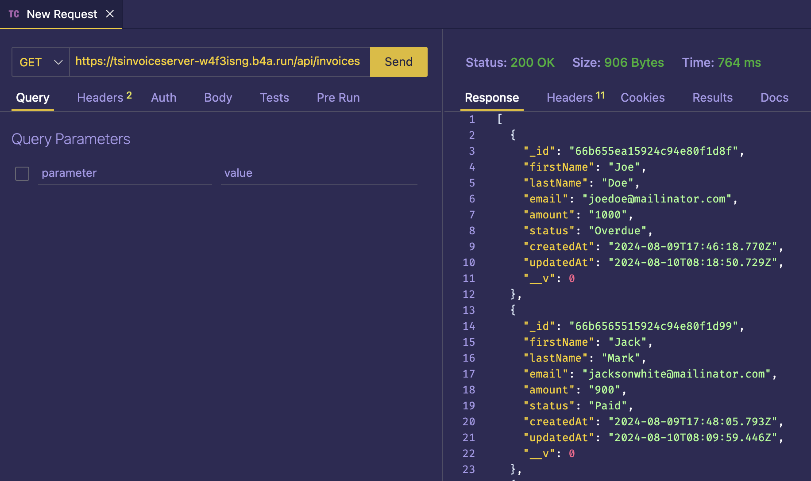

<h1>TS Invoice Matrix Server</h1>
<h6><i>Enjoy Ts Matrix and Integrate it with your application</i></h6>

# API FEATURES

- [Ts Matrix Production Link](https://tsinvoiceserver-w4f3isng.b4a.run/)

# Technologies

- [NodeJs](https://nodejs.org/en)
- [JavaScript](https://javascript.info/)
- [Nodemon](https://www.npmjs.com/package/nodemon)
- [MongoDB](https://www.mongodb.com/)
- [Express](https://expressjs.com/)
- [Mongoose](https://www.npmjs.com/package/mongoose)
- [PostMan](https://www.postman.com/)
- [Docker](https://www.docker.com/)

# Prototype

# How to Contribute

1. Clone the repository
   `git clone https://github.com/olatunde1998/ts-invoice-matrix-server.git`

2. Change directory into the cloned folder and run the setup script
   `cd  ts-invoice-matrix-server`

3. Open your terminal and type this command `npm install` to add the package to the app in the development mode.

4. Then after the installation of the dependency type this command `npm run dev` to run the app in your local environment

5. Copy this link [http://localhost:3000/](http://localhost:3000/) and paste it to your web browser(Chrome, safari, mozilla firefox et.c) to view it.

# License

The MIT License - Copyright (c) 2024 - Present, geodevcodes / Storage Service.

# Author

Rasheed Olatunde (Software Developer)
